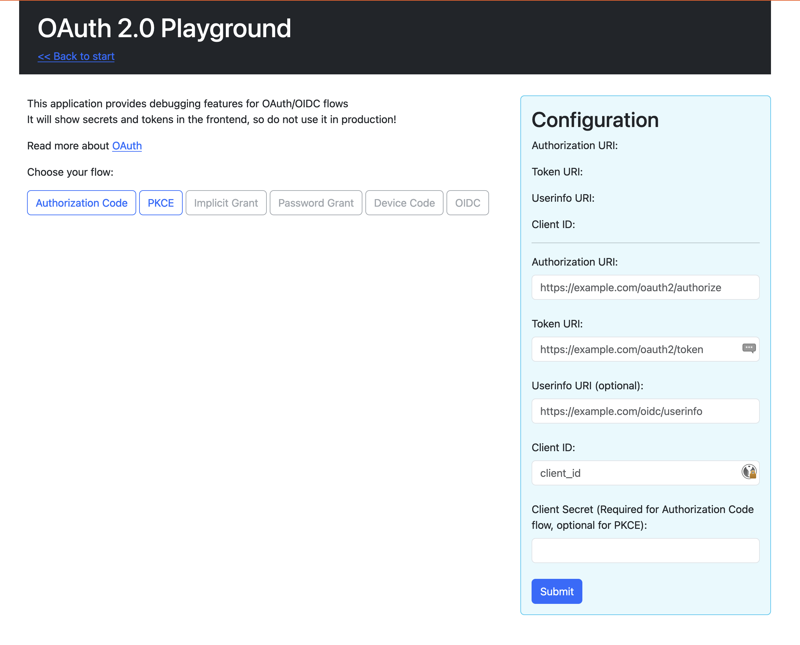
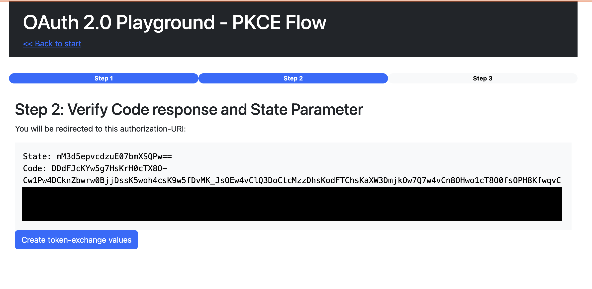

# OAuth 2.0 / OIDC Playground

This is a small golang application, that can be run either locally by running





## How to use

```sh
go build cmd/main.go
./main
```

Properties, like the token-uri, client-id and client-secret can either be set through the UI, or via environment
properties

```shell
export AUTHORIZATION_URI=https://your-identity-provider.com/oauth2/authorize
export TOKEN_URI=https://your-identity-provider.com/oauth2/token
export USERINFO_URI=https://your-identity-provider.com/oauth2/userinfo
export CLIENT_ID=your-client-id
export CLIENT_SECRET=your-client-secret
./main
```

or creating a docker-container and running it inside a kubernetes-cluster.

The intention is, that you can use it to connect to any Identity-Provider you like and test/debug the OAuth/OIDC flows
with your Provider.

> NOTE:
> This application must not be used in production, it is unsafe since it will display your access-token and does not
> provide https endpoints.

## Features

Currently, only the Authorization-Code and PKCE Grant are supported with the addition of requesting the userinfo endpoint.
